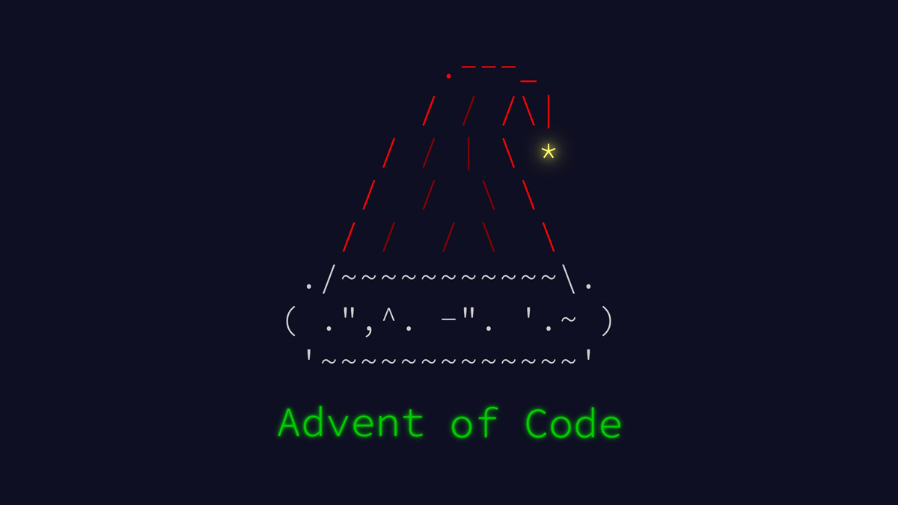

<div align="center">
  


# 🎄 Advent of Code 2025 🎄

[](https://adventofcode.com/2025)
[](https://www.python.org/)
[]()
[]()

**My second annual participation in the Advent of Code challenge!** 🚀

[🌐 Portfolio](https://abdullah-siddique-dev.netlify.app/) • [💼 LinkedIn](https://www.linkedin.com/in/mr-abdullah-siddique/)

</div>

---

## 📖 About This Repository

Welcome to my **Advent of Code 2025** solutions repository! This is my **second year** participating in this amazing coding challenge, and I'm excited to share my journey of solving creative programming puzzles throughout December.

This repository contains my solutions to the daily puzzles, written primarily in **Python**. Each solution is crafted with care, focusing on clean code, efficiency, and problem-solving skills. Whether you're here to learn, compare solutions, or just curious about my approach, feel free to explore!

---

## ✅ What is Advent of Code?

**Advent of Code** is an annual event featuring small, Christmas-themed programming puzzles that have captivated developers worldwide since its launch on December 1, 2015, by **Eric Wastl**.

### Key Features:
- 🎯 **Daily Puzzles**: Each calendar day unlocks a new puzzle with two parts—part 2 becomes available only after solving part 1
- 💻 **Language Agnostic**: Solutions can be written in any programming language
- 🌍 **For Everyone**: From hobbyists to experienced developers, anyone with basic programming knowledge can participate
- 🎓 **Learning Focus**: Perfect for learning new languages, sharpening coding skills, interview prep, or just having fun
- 🏆 **Personal Challenge**: Not about competition—it's about personal growth and problem-solving

---

## 🎯 What's Special About Advent of Code 2025?

This year brings exciting changes to the traditional format:

### 🆕 New Format:
- **12 Days of Puzzles** instead of the traditional 25 days (still starting December 1)
- **No Global Leaderboard**: The emphasis has shifted from worldwide competition to personal challenge and private-group fun
- **Same Great Quality**: The event remains free and accessible to everyone

### Why These Changes Matter:
- ✨ More focus on learning and enjoying the puzzles at your own pace
- 🤝 Better for team collaboration and learning exercises
- 🎄 Maintains the holiday spirit without the pressure of racing against thousands

---

## 🧩 What the Puzzles Are Like

The Advent of Code puzzles are carefully crafted to:

- 📈 **Progressive Difficulty**: Start simple but grow more complex and creative
- 🧠 **Brain Teasers**: The second part of each puzzle can be significantly tougher than the first
- 🎨 **Creative Themes**: Each puzzle comes with a fun, holiday-themed storyline
- ⚡ **Efficient**: Designed to run on modest hardware—no fancy specs needed
- 🔧 **Algorithm Practice**: Great for honing logic, data manipulation, and problem-solving skills

---

## 🎄 Why I'm Doing This

As someone passionate about **programming and problem-solving**, Advent of Code offers:

- 💡 **Skill Development**: A fantastic way to sharpen my programming and algorithmic thinking
- 🐍 **Python Mastery**: An opportunity to explore Python features and write idiomatic code
- 🎯 **Low-Pressure Learning**: With no global leaderboard, I can solve puzzles at my own pace and truly understand each solution
- 🎨 **Creative Break**: Working on holiday-themed puzzles provides a refreshing change from regular projects
- 📚 **Portfolio Building**: Demonstrates my problem-solving abilities and coding style
- 🌟 **Second Year Journey**: Building on last year's experience and pushing myself further

---

## 📁 Repository Structure

```
Advent of Code 2025/
│
├── AOC.jpg                 # Advent of Code banner
├── README.md               # You are here!
│
├── Day 1/
│   ├── input.txt          # Puzzle input
│   ├── part 1.py          # Solution for Part 1
│   └── part 2.py          # Solution for Part 2
│
├── Day 2/
│   ├── input.txt
│   ├── part 1.py
│   └── part 2.py
│
└── ... (more days to come)
```

---

## 🛠️ Technologies Used

- **Language**: Python 3.x
- **Approach**: Clean, readable, and efficient code
- **Focus**: Problem-solving, algorithms, and data structures

---

## 🚀 How to Run the Solutions

1. **Clone the repository**:
   ```bash
   git clone https://github.com/abdullah90907/Advent-of-Code-2025.git
   cd Advent-of-Code-2025
   ```

2. **Navigate to a specific day**:
   ```bash
   cd "Day 1"
   ```

3. **Run the solution**:
   ```bash
   python "part 1.py"
   python "part 2.py"
   ```

> **Note**: Each solution reads from the corresponding `input.txt` file in the same directory.

---

## 🌟 My Progress

| Day | Part 1 | Part 2 | Notes |
|-----|:------:|:------:|-------|
| 1   | ⭐     | ⭐     | Circular position tracking with modulo arithmetic |
| 2   | ⭐     | ⭐     | Invalid ID detection - repeating digit sequences |
| 3   | ⭐     | ⭐     | Maximum joltage calculation from digit pairs |
| 4   | ⭐     | ⭐     | Grid neighbor counting - accessible paper rolls |
| 5   | ⭐     | ⭐     | Range validation - fresh ingredient IDs |
| 6   | ⭐     | ⭐     | Vertical column parsing with operators |
| 7   | ⭐     | ⭐     | Beam splitting simulation through grid |
| 8   | ⭐     | ⭐     | 3D graph connectivity - Union-Find MST |
| 9   | 🔒     | 🔒     | Coming soon... |
| 10  | 🔒     | 🔒     | Coming soon... |
| 11  | 🔒     | 🔒     | Coming soon... |
| 12  | 🔒     | 🔒     | Coming soon... |

**Legend**: ⭐ Completed | 🔒 Locked | 🔄 In Progress

**Total Stars Earned**: 16 ⭐

---

## 💭 My Thoughts on Advent of Code

> "Advent of Code is more than just a coding challenge—it's a celebration of problem-solving, creativity, and the joy of programming. This is my second year participating, and I'm excited to see how much I've grown since last year. The puzzles are clever, the community is supportive, and the satisfaction of solving each puzzle is unmatched. Whether you're a beginner or a seasoned developer, there's something here for everyone!" 🎄✨

---

## 🔗 Connect With Me

I'd love to connect with fellow developers, problem-solvers, and Advent of Code enthusiasts!

- 🌐 **Portfolio**: [abdullah-siddique-dev.netlify.app](https://abdullah-siddique-dev.netlify.app/)
- 💼 **LinkedIn**: [mr-abdullah-siddique](https://www.linkedin.com/in/mr-abdullah-siddique/)
- 🐙 **GitHub**: [@abdullah90907](https://github.com/abdullah90907)

Feel free to reach out if you want to discuss solutions, collaborate on projects, or just chat about coding!


---

## 🙏 Acknowledgments

- **Eric Wastl** for creating and maintaining Advent of Code
- The **Advent of Code community** for the inspiration and support
- Everyone who's sharing their solutions and helping others learn

---

## 📜 License

This repository is open source and available under the [MIT License](LICENSE). Feel free to explore, learn, and share!

---

<div align="center">

**Happy Coding! 🎄✨**

*Made with ❤️ and lots of ☕ by Abdullah*

⭐ **If you find this repository helpful, consider giving it a star!** ⭐

</div>
